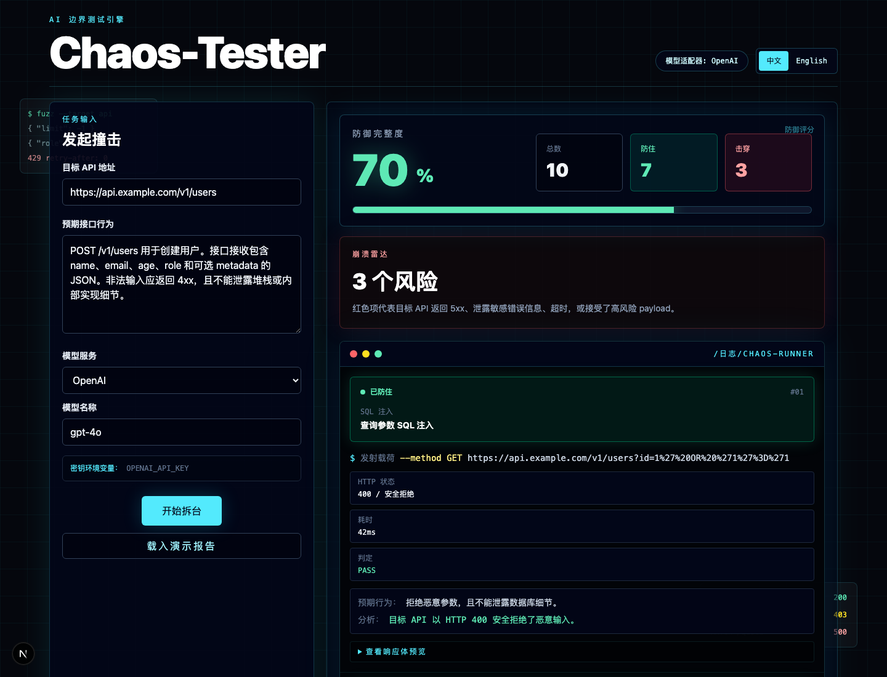

# Chaos-Tester

Chaos-Tester 是一个 AI 驱动的 API 边界测试引擎。用户输入目标 API 地址和接口预期行为，系统会调用大模型生成结构化的恶意/边界测试用例，再由执行器真实请求目标 API，最终输出防御率、崩溃项和终端风格日志。

> 仅用于你拥有授权的 API、测试环境或靶场环境。不要对第三方系统发起未经授权的请求。

## 界面预览



## 功能特性

- Next.js App Router + TypeScript + Tailwind CSS
- 中英双语 UI 切换
- 响应式赛博朋克风 Dashboard
- 支持多模型适配：OpenAI、Claude、Gemini、DeepSeek、Qwen、MiniMax、GLM、MiMo、自定义 OpenAI-compatible 接口
- 使用结构化输出生成测试用例
- 执行器支持超时控制、同源 URL 防护、并发限制、响应体预览
- 自动判定 PASS/FAIL：4xx 安全拒绝通常视为防住，5xx、超时、敏感信息泄露或接受高风险 payload 视为击穿
- 内置演示报告，方便无 API Key 时预览界面

## 技术栈

- Next.js 16
- React 19
- TypeScript
- Tailwind CSS 4
- OpenAI SDK
- Anthropic SDK
- Google GenAI SDK
- Vitest
- ESLint

## 快速开始

```bash
npm install
cp .env.example .env.local
npm run dev
```

打开：

```text
http://localhost:3000
```

如果只想看界面，可以不配置 API Key，首页会默认展示一份演示报告。

## 环境变量

复制 `.env.example` 为 `.env.local`，按你要使用的模型服务填写。

### OpenAI

```bash
OPENAI_API_KEY=
OPENAI_MODEL=gpt-4o
```

### Claude

```bash
ANTHROPIC_API_KEY=
ANTHROPIC_MODEL=claude-3-5-sonnet-latest
```

### Gemini

```bash
GEMINI_API_KEY=
GEMINI_MODEL=gemini-2.5-flash
```

### DeepSeek

```bash
DEEPSEEK_API_KEY=
DEEPSEEK_MODEL=deepseek-chat
DEEPSEEK_BASE_URL=https://api.deepseek.com/v1
```

### Qwen / DashScope

```bash
QWEN_API_KEY=
DASHSCOPE_API_KEY=
QWEN_MODEL=qwen-plus
QWEN_BASE_URL=https://dashscope.aliyuncs.com/compatible-mode/v1
```

### MiniMax

```bash
MINIMAX_API_KEY=
MINIMAX_MODEL=MiniMax-M1
MINIMAX_BASE_URL=https://api.minimax.chat/v1
```

### GLM / 智谱

```bash
GLM_API_KEY=
ZHIPU_API_KEY=
GLM_MODEL=glm-4-plus
GLM_BASE_URL=https://open.bigmodel.cn/api/paas/v4
```

### MiMo

```bash
MIMO_API_KEY=
MIMO_MODEL=mimo-v2.5-pro
MIMO_BASE_URL=
```

### 自定义 OpenAI-compatible 接口

```bash
CUSTOM_LLM_BASE_URL=
CUSTOM_LLM_API_KEY=
CUSTOM_LLM_MODEL=
```

API Key 只在服务端读取，不会进入前端页面。

## 使用方式

1. 在首页填写目标 API 地址。
2. 描述接口的正常行为、参数结构、鉴权要求和错误处理预期。
3. 选择模型服务和模型名称。
4. 点击“开始拆台”。
5. 查看防御评分、击穿数量和逐条终端日志。

示例目标说明：

```text
POST /v1/users 用于创建用户。接口接收包含 name、email、age、role 和可选 metadata 的 JSON。
非法输入应返回 4xx，且不能泄露堆栈或内部实现细节。
```

## 常用命令

```bash
npm run dev      # 本地开发
npm run lint     # 代码检查
npm test         # 单元测试
npm run build    # 生产构建
npm run start    # 本地启动生产构建
```

## 目录结构

```text
app/
  api/generate-tests/route.ts     # 后端 API 路由：生成用例并执行测试
  globals.css                     # 全局样式
  layout.tsx
  page.tsx
components/
  ChaosWorkbench.tsx              # 首页工作台
  ChaosResultsDashboard.tsx       # 测试结果 Dashboard
lib/
  chaos/
    demo-report.ts                # 演示报告数据
    prompt.ts                     # System Prompt
    runner.ts                     # 请求执行器和判定逻辑
    schema.ts                     # 测试用例 JSON Schema
    types.ts
    validation.ts                 # 模型输出校验
  llm/
    config.ts                     # 模型配置解析
    generate-test-cases.ts        # 多模型生成逻辑
    provider-registry.ts          # 模型服务注册表
tests/
  llm-config.test.ts
  runner.test.ts
  test-case-validation.test.ts
```

## 安全边界

Chaos-Tester 会对目标地址发起真实请求。建议：

- 只测试自己拥有授权的 API。
- 优先使用本地、预发、沙箱或专用靶场环境。
- 不要把生产数据库、真实支付、真实短信/邮件接口接到测试环境。
- 给测试目标设置限流和审计日志。
- 不要把 `.env.local`、API Key 或真实测试报告提交到 GitHub。

## 部署

推荐先部署到 Vercel。它对 Next.js 支持最省心，会自动识别项目并运行构建。

如果后续要做长时间扫描、队列、定时任务、多目标批量测试，建议把“请求执行器”拆成独立后端服务，部署到 Render、Railway、Fly.io 或自有服务器；前端和报告页仍然可以留在 Vercel。

详细步骤见 [DEPLOYMENT.md](./DEPLOYMENT.md)。
